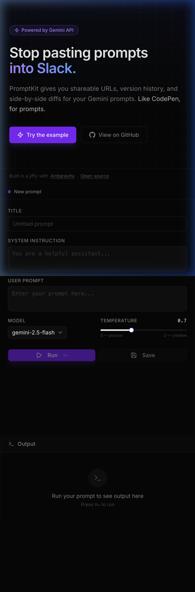

# PromptKit

Shareable, versionable prompts for the Gemini API. The thing AI Studio is missing.

**[Live demo](https://promptkit-seven.vercel.app)**

## What it does

PromptKit is CodePen for prompts. Author a prompt with a system instruction, user prompt, model, and temperature. Run it against the Gemini API. Hit Save and get a permanent shareable URL that captures the full state. Anyone can fork your prompt to remix it, and the fork chain becomes a visible version history with side-by-side diffs between any two versions.



## Why it exists

AI Studio is the right surface for prompt engineering, but the collaborative layer is missing. There is no version history, no diff between iterations, no shareable URL that captures the full prompt state. PromptKit fills that gap.

## Stack

Next.js 16, Tailwind v4, shadcn/ui (Base UI), Supabase Postgres, @google/generative-ai SDK, Vercel.

## Getting started

```bash
# 1. Clone and install
git clone https://github.com/dsapru/promptkit
cd promptkit
pnpm install

# 2. Add environment variables
cp .env.local.example .env.local
# Fill in GEMINI_API_KEY, NEXT_PUBLIC_SUPABASE_URL, NEXT_PUBLIC_SUPABASE_PUBLISHABLE_KEY

# 3. Set up the database (run in Supabase SQL editor)
# See schema below

# 4. Seed the featured example
pnpm seed

# 5. Run locally
pnpm dev
```

## Database schema

```sql
create table prompts (
  id uuid primary key default gen_random_uuid(),
  parent_id uuid references prompts(id),
  title text,
  system_instruction text,
  user_prompt text not null,
  model text not null,
  temperature real not null,
  output text,
  edit_token text not null,
  created_at timestamptz default now()
);
create index on prompts (parent_id);
alter table prompts enable row level security;
create policy "anyone can read" on prompts for select using (true);
create policy "anyone can insert" on prompts for insert with check (true);
```

## Built with

Antigravity, in a giffy.

## License

MIT
